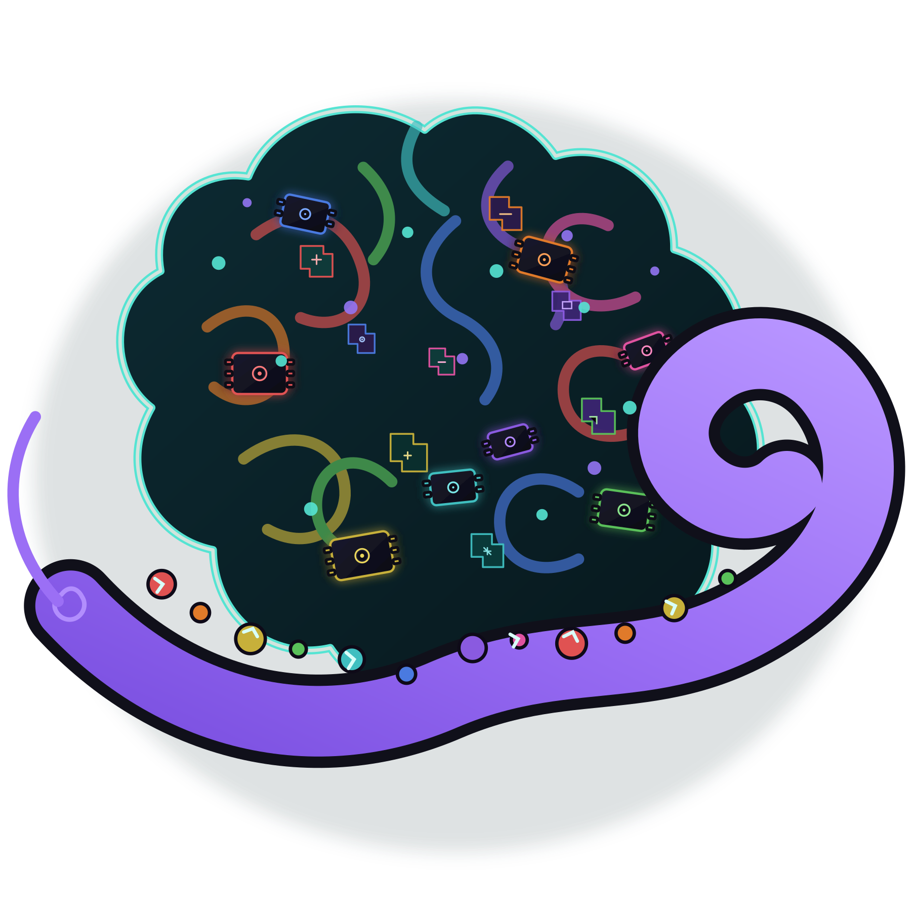
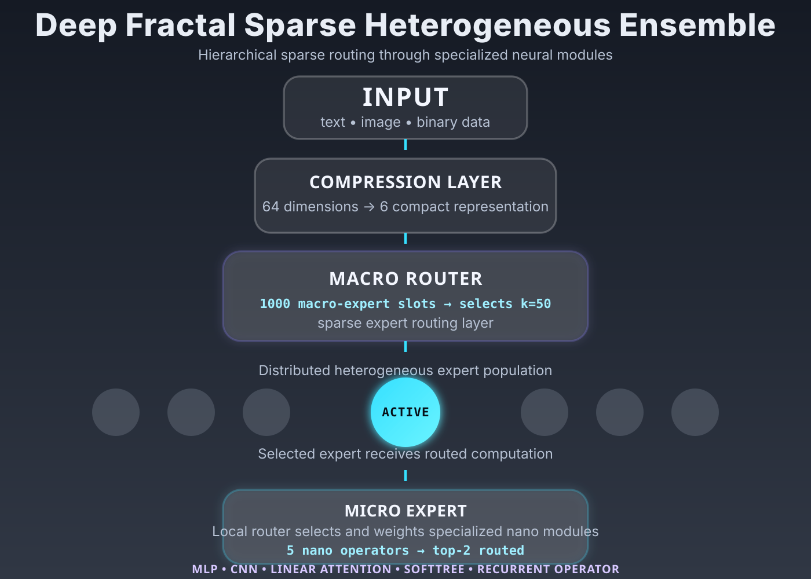
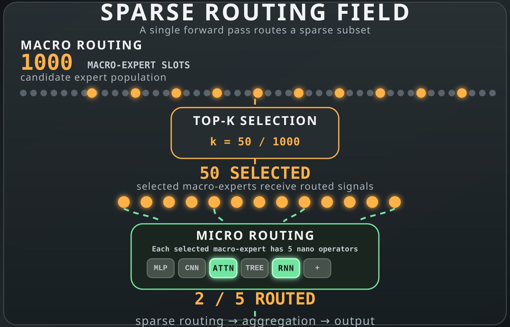
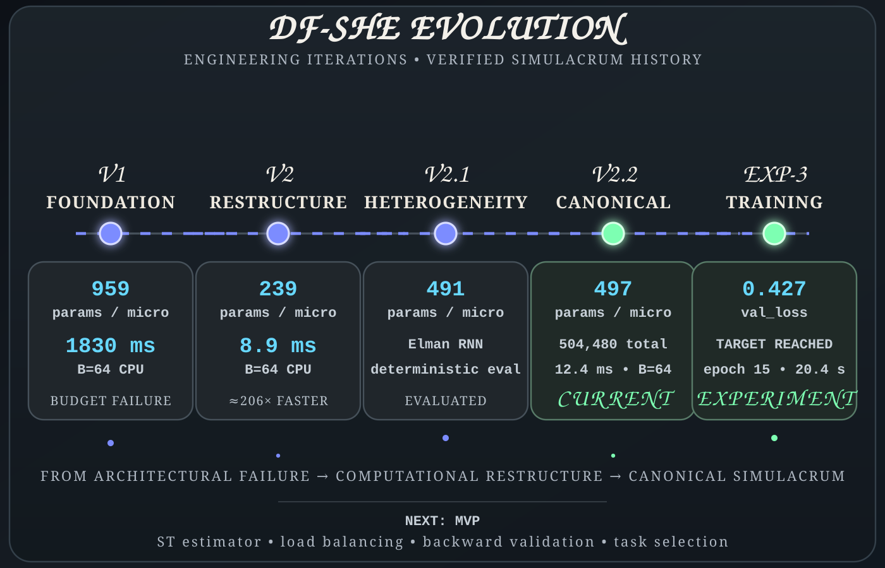

# DF-SHE

  

### — *Distributed Fractal Sparse Hierarchical Engine*

«“*What if resource degradation could become architectural and scientific progress?*”»

### 1,830 ms → 8.9 ms 
***(~205.6× faster •/•
~99.51% less execution)***
*Experimental Environment*

Prototype → to → Final Simulacrum Stage:
*Google Colab · Intel(R) Xeon(R) CPU @ 2.20 GHz · 2 virtual cores*

An early DF-SHE Simulacrum iteration reduced measured CPU execution time from 1,830 ms to 8.9 ms at batch size 64 through architectural restructuring.

The result became a question:

*how far can computation be deliberately reduced while the system remains useful?*

### What is DF-SHE?

An experimental research project investigating architectural resilience under deliberately constrained computational resources.

Resource degradation as architectural and scientific progress.

The implementation may change. The research question remains.

---

### Current Stage

**V2.2** — current canonical architecture.

Experimental research and validation stage, with the architecture implemented and further training and validation under development.

[Current-CORE](https://github.com/SouDevail/DF-SHE/tree/main/Current-CORE) · [V2.2 Simulacrum](https://github.com/SouDevail/DF-SHE/blob/main/Current-CORE/SIMULACRUM_CORE/simulacrum-V2.2.py) · [STATUS.md](https://github.com/SouDevail/DF-SHE/blob/main/STATUS.md) · [HISTORY.md](https://github.com/SouDevail/DF-SHE/blob/main/HISTORY.md)

---

# Constitution of Responsibility

---

**STRICT, Immutable Rules for Life>:**

*Ordered by priority — 01 is the highest priority.*

**[01 — CPU Only]**

*Every experiment is CPU-only. No exceptions.*

**[02 — Deliberate Resource Degradation]**

*Intentional resource degradation is treated as a path toward architectural and scientific progress through continuous stress-testing from early development to the final product.*

**[03 — Extended Open Source]**

*Code and research process remain open: problems, failures, experiments, results and relevant details.*

**Demanding but FLEXIBLE Principles:**

*(Ordered by priority)*

**|01 — Community-Based Architecture|**

*Architecture is created through the community rather than by a single developer. The original author remains the project's legal and original leading authority.*

**|02 — No Sacred Architecture|**

*No architectural decision is immune to challenge, testing or revision.*

---

# The Architecture

  

A hierarchical computational structure combining specialized units, controlled information flow and selective participation.

---

# Sparse Computation

  

Computational participation is deliberately limited rather than uniformly distributed.

***computation → efficiency → capability → degradation***

---

# Research Record

  

Experiments, improvements, failures and architectural changes remain part of the public research record.

[HISTORY.md](https://github.com/SouDevail/DF-SHE/blob/main/HISTORY.md) · [STATUS.md](https://github.com/SouDevail/DF-SHE/blob/main/STATUS.md)

---

# Research Layer

The conceptual side of DF-SHE lives in [Paperlands](https://github.com/SouDevail/DF-SHE/tree/main/Paperlands):

[START-HERE.md](https://github.com/SouDevail/DF-SHE/blob/main/Paperlands/START-HERE.md) · [Philosophy.md](https://github.com/SouDevail/DF-SHE/blob/main/Paperlands/Philosophy.md) · [Motivation.md](https://github.com/SouDevail/DF-SHE/blob/main/Paperlands/Motivation.md) · [Theories.md](https://github.com/SouDevail/DF-SHE/blob/main/Paperlands/Theories.md) · [Hypothesis.md](https://github.com/SouDevail/DF-SHE/blob/main/Paperlands/Hypothesis.md) · [Uncomfortable_FAQ.md](https://github.com/SouDevail/DF-SHE/blob/main/Paperlands/Uncomfortable_FAQ.md)

---

[Current-CORE](https://github.com/SouDevail/DF-SHE/tree/main/Current-CORE) · [Experiments](https://github.com/SouDevail/DF-SHE/tree/main/Experiments) · [OLD-Archive](https://github.com/SouDevail/DF-SHE/tree/main/OLD-Archive)

---

Build. Measure. Challenge. Learn.
